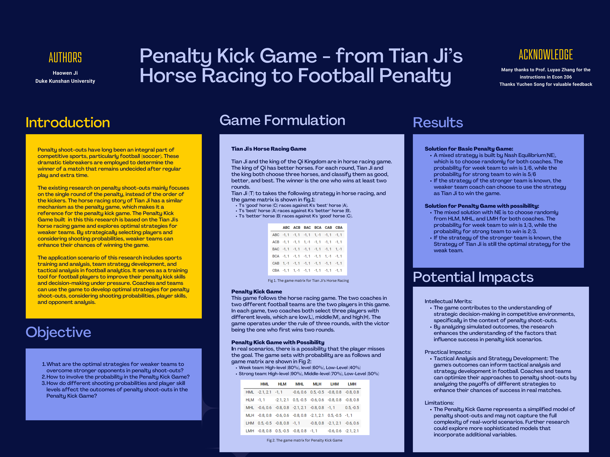
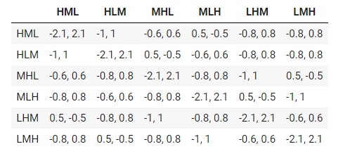

# Penalty Kick Game - from Tian Ji’s Horse Racing to Football Penalty
## Project information
- **Author**: Haowen Ji, Data Science, 2023, Duke Kunshan University
- **Instructor**: Prof. Luyao Zhang, Duke Kunshan University
- **Disclaimer**: Submissions to Final Project for [COMPSCI/ECON 206 Computational Microeconomics, 2023 Spring (Seven Week - Second)](https://ce.pubpub.org/) instructed by Prof. Luyao Zhang at Duke Kunshan University.
- **Acknowledgments**: I would like to express my sincere gratitude to Professor Luyao Zhang for providing valuable instructions and for inspiring the idea of combining Tian Ji's Horse Racing and the Penalty Kick Game. Thanks Yuchen, Cong Rong, and Yiyuan for their advice and inspiration throughout my final project. Furthermore, I would like to thank everyone in the class for their enthusiasm and contributions. The engaging discussions and shared knowledge have truly made this a stimulating learning experience.

- **Project Summary**: The Penalty Kick Game is a strategic game involving two teams, a weak team and a strong team, competing in a penalty shoot-out scenario. The game revolves around the selection of players and the order of their kicks, with the objective of maximizing the team's payoff. Each team's success in scoring goals and preventing goals is determined by shooting probabilities associated with the players. The game matrix captures the payoffs for different strategy combinations, representing the outcomes for both teams. By strategically choosing players and determining the kicking order, teams aim to achieve the highest possible payoff. The game provides insights into optimal strategies for weaker teams to overcome stronger opponents, the influence of shooting probabilities on outcomes, and the role of probability in the game. The findings contribute to understanding the dynamics of penalty shoot-outs and can have implications in real-world soccer scenarios. More details about the project summray is in [this PDF](https://github.com/Rising-Stars-by-Sunshine/csecon206-haowen-finalproject/blob/main/spotlight/CSECON206_Final_Spring2023_Haowen.pdf)

## Table of Contents

- [polished problem set 1 and problem set 2](#polished-ps1-and-ps2)
- [model](#model)
- [code](#code)
- [spotlight](#spotlight)
- [more about the author](#more-about-the-author)
- [references](#references)

### Polished PS1 and PS2
- **Polished PS 1**: [CSEcon206-Haowen-PS1](https://github.com/Rising-Stars-by-Sunshine/CSEcon206-Haowen-PS1), the following modifications have been made:
  - The game environment part has been modified based on the feedback, more specificly, the strategies of the two players has been clearly stated and the payoff has been adjusted based on the strategy part
  - The backward induction solution has been revised, the wrong concepts have been replaced and the logic has been coherent
  - The efficiency and fairness part has been improved to be clearer, and the definitions of efficiency and equity are supported by the literature
  - The citations of terminologies has been added
  - The text in the readme was polished by Grammarly
- **Polished PS 2**: [CSEcon206-Haowen-PS2](https://github.com/Rising-Stars-by-Sunshine/CSEcon206-Haowen-PS2), the following modifications have been made:
  - The red log has been cleaned by adding codes before the package
  - The citations for books and page numbers have been provided following the definition and theorem
  - The PDF has been uploaded to the repo and attched in the spotlight
  - The text in the readme was polished by Grammarly

### Model
- Game Environment
  - Set of Players: The Penalty Kick Game involves two players: the weak team (W) and the strong team (S). Each team is represented by a coach or decision-maker who selects players and determines the shooting strategies.
  - Strategies: Both the weak team and the strong team have multiple strategies to choose from. The weak team can strategically select players and decide the order of their kicks, for example, the order can be high-level, middle-level, and low-level, while the strong team can also choose the order of their kicks.
  - Payoffs: The payoffs in the Penalty Kick Game represent the outcomes for both teams. The payoffs depend on the choices made by each team and the shooting probabilities associated with the players. The specific payoffs are represented in the game matrix, where each cell shows the outcome (payoff) for the weak team followed by the outcome (payoff) for the strong team for a particular combination of strategies.
- Solution Concept
  - The existing solution concept that serves as a benchmark in this research is Tian Ji's horse racing strategy, which was originally applied in the context of horse racing. This strategy inspired the design of the Penalty Kick Game and its application to penalty shoot-outs. Building upon Tian Ji's strategy, the research proposes a modified strategy specifically tailored to the Penalty Kick Game. The modified strategy takes into account the unique dynamics and variables of penalty shoot-outs. The modified strategy considers shooting probabilities and player skill levels to determine the optimal choices for weaker teams facing stronger opponents, which aims to enhance the weaker team's chances of winning rounds. By adapting and applying Tian Ji's strategy to the Penalty Kick Game, the research integrates game theory principles with the specific context of penalty shoot-outs. This integration allows for a refined and contextually relevant solution concept that addresses the challenges and dynamics inherent in penalty shoot-outs.

- Evaluations: e.g. efficiency and fairness
  - Efficiency refers to the allocation of resources in a way that maximizes the total welfare or outcome of a game. Fairness, on the other hand, pertains to the distribution of outcomes in a manner that is perceived as just or equitable (Dugatkin and Bekoff 2003).
  - Nash Equilibrium: From an efficiency standpoint, Nash equilibrium ensures that no player can unilaterally improve their payoff by deviating from their chosen strategy, given the strategies chosen by other players. It represents a stable state where players have reached an optimal outcome considering the actions of all participants. However, Nash equilibrium does not guarantee the highest overall welfare or payoff for the players. It focuses on individual rationality rather than maximizing collective gains. Therefore, the efficiency of Nash equilibrium depends on the specific game and its desired outcome.
  - Tian Ji's Strategy: Tian Ji's strategy aims to maximize the weak team's chances of winning against a strong opponent. It exploits the potential predictability of the strong team's choices by selecting a winning response based on the opponent's strategy. In terms of efficiency, Tian Ji's strategy is effective in improving the weak team's prospects of winning the game. By strategically adapting to the strong team's choices, it provides a competitive advantage and increases the overall welfare of the weak team.
  - Fairness considerations depend on the definition of fairness adopted. Nash equilibrium focuses on individual rationality and does not inherently consider fairness principles such as equality or proportionality. Tian Ji's strategy, on the other hand, can be seen as a response to the potential imbalance of power between the weak and strong teams. It aims to level the playing field by exploiting predictability and creating a more equitable outcome. However, fairness is subjective, and different perspectives may lead to different interpretations of what constitutes a fair outcome in the context of the game.


### Code
The code for the Penalty Kick Game is [Penalty_Kick_Game](https://github.com/Rising-Stars-by-Sunshine/csecon206-haowen-finalproject/blob/main/code/Code_for_Penalty_Kick_Game.ipynb)
- Strategic plays
  - Each coach has multiple options available, represented by different combinations of shooting probabilities and player skill levels. The coaches strategically analyze the potential outcomes and choose the strategies that maximize their team's chances of winning the game. The strategic plays involve considering various factors such as the shooting probabilities, player skill levels, and the opponent's potential choices. Coaches aim to exploit the weaknesses of the opposing team while capitalizing on their own strengths. They assess the potential payoffs and choose the strategies that offer the highest expected outcomes based on their understanding of the game dynamics.

- Equilibruim Evaluations:
  - For the Penalty Kick Game withput Probability, a mixed Nash equilibrium strategy exists and the dominant strategy for both Teams is to choose randomly. If the weak team does not know the strategy of the other team, both players can change their strategies. The dominant strategy for the strong team is to choose randomly. Regardless of the strategy he chooses, the probability for the strong team to win is 5/6. The expected payoff for S is 5/6. The probability for the weak team to win is 1/6. The expected payoff for the weak team is -5/6. However, based on Tian Ji's strategy, the weak team can always win in each round if the coach knows the strategy of the other team. For the Penalty Kick Game with Probability, a mixed Nash equilibrium strategy exists in this setting. The dominant strategy for both teams is to choose randomly from HLM, MHL, and LMH. The probability for the strong team to win is 2/3. The expected payoff is 7/10. The probability for the weak team to win is 1/3. The expected payoff is -7/10. However, based on Tian Ji's strategy, the weak team can still win in each round if the coach knows the strategy of the other team, regardless of the probability.


### Spotlight
- Poster
  - The final version of the poster is shown in Figure 1. This poster gives an overview of the Penalty Kick Game. It contains five sections: *Introduction*, *Objective*, *Game Formulation*, *Results*, *Potential Impacts*  
  - This poster is created by [Canva](https://www.canva.com/)


<p align="center">Figure 1: Poster of the final project</p>

- Figures
  - The game matrix for the penalty game is in Figure 2, which shows the payoffs of the corresponding strategy.
  - The detailed representations can be found at this [file](https://github.com/Rising-Stars-by-Sunshine/csecon206-haowen-finalproject/blob/main/code/Code_for_Penalty_Kick_Game.ipynb)
  - The detalied information about the game can be found at this [PDF](https://github.com/Rising-Stars-by-Sunshine/csecon206-haowen-finalproject/blob/main/spotlight/CSECON206_Final_Spring2023_Haowen.pdf)


<p align="center">Figure 2: Game matrix for the Penalty Kick Game with possibility</p>

- Slides and Presentations
  - This is the [slides](https://github.com/Rising-Stars-by-Sunshine/csecon206-haowen-finalproject/blob/main/spotlight/Econ206_Pre_Haowen.pptx) for presentations, which can be found in the spotlight file. These slides went through the content of the Penalty Kick Game and provide a real-world example.

### More about the Author
<div align=center>
<br/>
</div>
 
- **Self Introduction**: 
Haowen Ji is a senior student in Data Science major at DKU, who is intereted in the data science’s application in the real world, such as price evaluation and automatic driving and still seeking more implementation opportunities to leverage data science.

- Final reflections 
  - intellectual growth
  - professional growth
  - living a purposeful life

### References

- Literature References in [Chicago Author-Date](https://www.chicagomanualofstyle.org/tools_citationguide/citation-guide-2.html) Style and [BibTex](https://scholar.google.com/) 

- Biggs, Adam T., Michelle R. Kramer, and Stephen R. Mitroff. 2018. “Using Cognitive Psychology Research to Inform Professional Visual Search Operations.” Journal of Applied Research in Memory and Cognition 7 (2): 189–98. https://doi.org/10.1016/j.jarmac.2018.04.001.
- Dugatkin, Lee Alan, and Marc Bekoff. 2003. “Play and the Evolution of Fairness: A Game Theory Model.” Behavioural Processes 60 (3): 209–14. https://doi.org/10.1016/s0376-6357(02)00120-1.
- Gilad, Benjamin, Stanley Kaish, and Peter D. Loeb. 1984. “From Economic Behavior to Behavioral Economics: The Behavioral Uprising in Economics.” Journal of Behavioral Economics 13 (2): 3–24. https://doi.org/10.1016/0090-5720(84)90001-9.
- Jordet, Geir, Esther Hartman, Chris Visscher, and Koen A. P. M. Lemmink. 2007. “Kicks from the Penalty Mark in Soccer: The Roles of Stress,Skill, and Fatigue for Kick Outcomes.” Journal of Sports Sciences 25 (2): 121–29. https://doi.org/10.1080/02640410600624020.
- Kremer, J. 1996. “Sports Psychology in Action.” British Journal of Sports Medicine 30 (4): 366–66. https://doi.org/10.1136/bjsm.30.4.366-b.
- McGarry, Tim, and Ian M. Franks. 2000. “On Winning the Penalty Shoot-out in Soccer.” Journal of Sports Sciences 18 (6): 401–9. https://doi.org/10.1080/02640410050074331.
- Van Der Kamp, John. 2006. “A Field Simulation Study of the Effectiveness of Penalty Kick Strategies in Soccer: Late Alterations of Kick Direction Increase Errors and Reduce Accuracy.” Journal of Sports Sciences 24 (5): 467–77. https://doi.org/10.1080/02640410500190841.

```
@article{biggs_kramer_mitroff_2018, title={Using Cognitive Psychology Research to Inform Professional Visual Search Operations}, volume={7}, DOI={https://doi.org/10.1016/j.jarmac.2018.04.001}, number={2}, journal={Journal of Applied Research in Memory and Cognition}, author={Biggs, Adam T. and Kramer, Michelle R. and Mitroff, Stephen R.}, year={2018}, month={Jun}, pages={189–198} }

@article{dugatkin_bekoff_2003, title={Play and the evolution of fairness: a game theory model}, volume={60}, DOI={https://doi.org/10.1016/s0376-6357(02)00120-1}, number={3}, journal={Behavioural Processes}, author={Dugatkin, Lee Alan and Bekoff, Marc}, year={2003}, month={Jan}, pages={209–214} } 

@article{gilad_kaish_loeb_1984, title={From economic behavior to behavioral economics: The behavioral uprising in economics}, volume={13}, DOI={https://doi.org/10.1016/0090-5720(84)90001-9}, number={2}, journal={Journal of Behavioral Economics}, author={Gilad, Benjamin and Kaish, Stanley and Loeb, Peter D.}, year={1984}, month={Dec}, pages={3–24} } 

@article{jordet_hartman_visscher_lemmink_2007, title={Kicks from the penalty mark in soccer: The roles of stress,skill, and fatigue for kick outcomes}, volume={25}, DOI={https://doi.org/10.1080/02640410600624020}, number={2}, journal={Journal of Sports Sciences}, author={Jordet, Geir and Hartman, Esther and Visscher, Chris and Lemmink, Koen A. P. M.}, year={2007}, month={Jan}, pages={121–129} } 

@article{kremer_1996, title={Sports Psychology in Action}, volume={30}, DOI={https://doi.org/10.1136/bjsm.30.4.366-b}, number={4}, journal={British Journal of Sports Medicine}, author={Kremer, J.}, year={1996}, month={Dec}, pages={366–366} } 

@article{mcgarry_franks_2000, title={On winning the penalty shoot-out in soccer}, volume={18}, DOI={https://doi.org/10.1080/02640410050074331}, number={6}, journal={Journal of Sports Sciences}, author={McGarry, Tim and Franks, Ian M.}, year={2000}, month={Jan}, pages={401–409} } 

@article{van der kamp_2006, title={A field simulation study of the effectiveness of penalty kick strategies in soccer: Late alterations of kick direction increase errors and reduce accuracy}, volume={24}, DOI={https://doi.org/10.1080/02640410500190841}, number={5}, journal={Journal of Sports Sciences}, author={Van Der Kamp, John}, year={2006}, month={May}, pages={467–477} }
```

